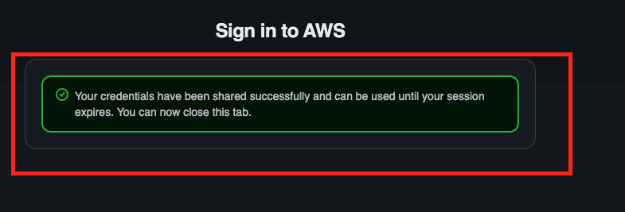

# 🚀 User Manual - SSO & SSM Configuration Setup

This guide explains how to configure **AWS SSO**, **AWS Session Manager (SSM)**, and the required local utilities on both **macOS** and **Windows** systems.

---

# 📋 Prerequisites

Ensure the following tools are installed before proceeding:

| Tool                   | Purpose                                   |
| ---------------------- | ----------------------------------------- |
| AWS CLI                | AWS authentication and operations         |
| Session Manager Plugin | Connect to EC2 instances through SSM      |
| Git                    | Clone and update configuration repository |

---

# ⚠️ Mandatory Checks Before Installation

## 🍏 macOS Users

Verify your current shell:

```bash
echo $SHELL
```

If the output is:

```bash
/bin/bash
```

Switch to **zsh** using:

```bash
chsh -s $(which zsh)
```

Close and reopen your terminal, then verify again:

```bash
echo $SHELL
```

Expected output:

```bash
/bin/zsh
```

---

## 🪟 Windows Users

Open **PowerShell** as a normal user (not Administrator) and execute:

```powershell
Set-ExecutionPolicy -ExecutionPolicy RemoteSigned -Scope CurrentUser
```

This allows locally installed PowerShell scripts to run successfully.

---

# 📥 Install SSO Configuration

## Step 1: Clone Repository

```bash
git clone https://github.com/Audintel-Dev/sso-ssm-configuration.git
```

---

## 🍏 macOS Installation

Navigate to the macOS installation directory:

```bash
cd sso-ssm-configuration/mac-linux
```

Run:

```bash
bash install.sh
```

---

## 🪟 Windows Installation

Navigate to the Windows installation directory:

```powershell
cd sso-ssm-configuration/windows
```

Run:

```powershell
./install.ps1
```

---

# 🔄 Updating Existing Configuration

Whenever new configuration changes are released:

```bash
cd sso-ssm-configuration
git pull
```

After pulling the latest changes, repeat the installation steps corresponding to your operating system.

---

# 🔐 AWS SSO Configuration (One-Time Setup)

Open:

* **Terminal** (macOS)
* **PowerShell** (Windows)

Run:

```bash
aws configure sso
```

---

## Configuration Values

### SSO Session Name

Recommended values:

```text
uat
```

or

```text
prod
```

Choose based on the environment you are configuring.

---

### SSO Start URL

```text
https://d-9f676488e3.awsapps.com/start
```

---

### SSO Region

```text
ap-south-1
```

---

### SSO Registration Scopes

Press **Enter** to accept the default value:

```text
sso:account:access
```

---

## Browser Authentication

After completing the above steps:

1. A browser window will open automatically.
2. Click **Allow Access**.



> ⚠️ If you select a different Google account, authentication may fail and return a **404 error**.

---

## AWS Account Selection

You will be prompted to choose an AWS account.

### UAT Account

```text
Audintel@UAT, raghu@audintel.in (670307493739)
```

### Production Account

```text
Raghavendra Sinha, raghu@audintel.com (471201224424)
```

Select the appropriate account based on the environment.

---

## Role Selection

After selecting the account:

1. Choose the AWS role assigned to you.
2. Press Enter.

---

## Default Region

```text
us-east-1
```

---

## CLI Output Format

```text
json
```

---

## Profile Name

When prompted:

```text
Profile name [uat-DBA-permissions-670307493739]:
```

Use:

```text
uat
```

or

```text
prod
```

matching the SSO Session Name you entered earlier.

### Recommended

```text
uat
```

```text
prod
```

### Not Recommended

```text
uat-DBA-permissions-670307493739
```

Using shorter profile names makes commands easier to remember and maintain.

---

# ✅ Verify SSO Configuration

### UAT

```bash
aws sts get-caller-identity --profile uat
```

### Production

```bash
aws sts get-caller-identity --profile prod
```

Expected output:

```json
{
  "UserId": "XXXXXXXXXXXX",
  "Account": "XXXXXXXXXXXX",
  "Arn": "arn:aws:sts::XXXXXXXXXXXX:assumed-role/..."
}
```

If the command returns account details successfully, your SSO configuration is complete.

---

# 🎉 Setup Completed

You are now ready to:

* Access AWS resources using SSO
* Connect to EC2 instances via Session Manager (SSM)
* Use the provided Audintel automation scripts and tooling
